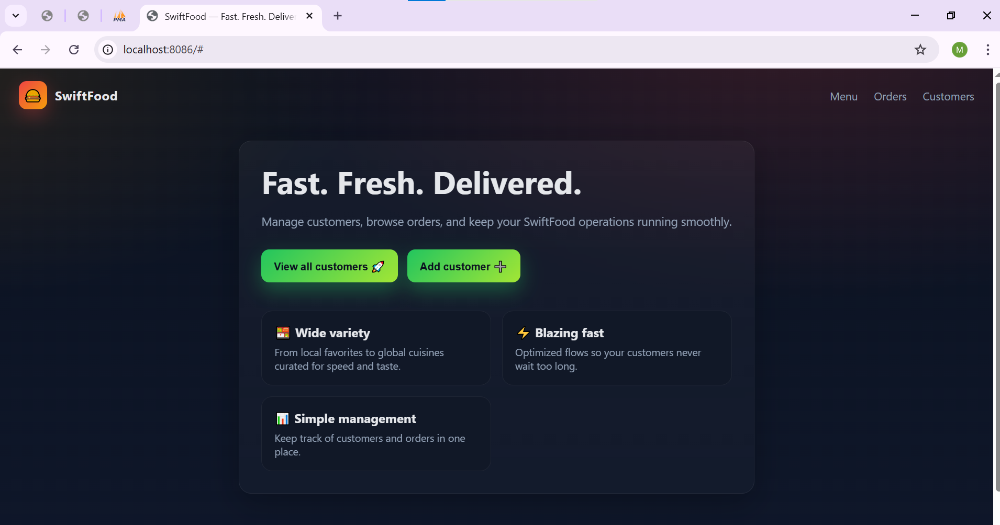
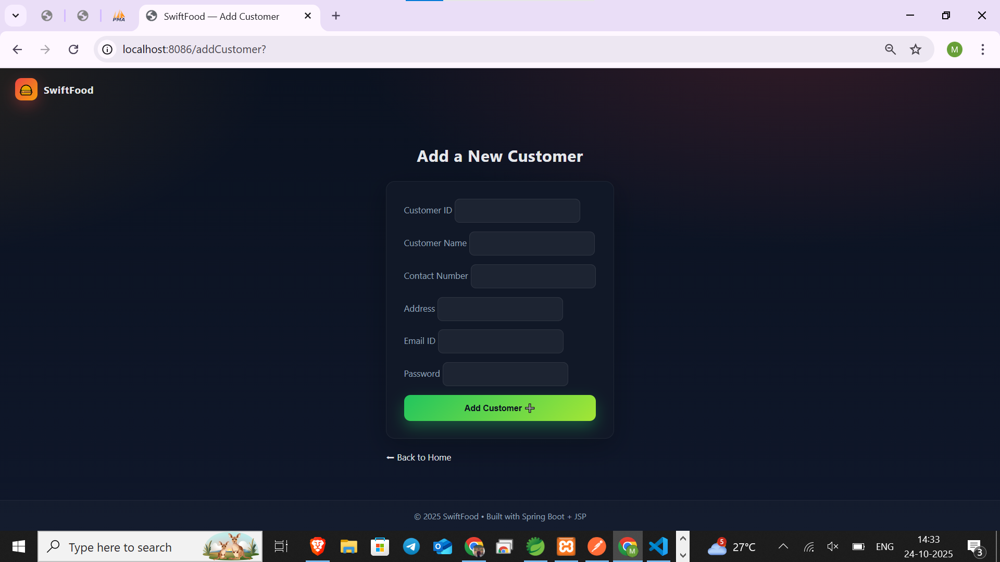
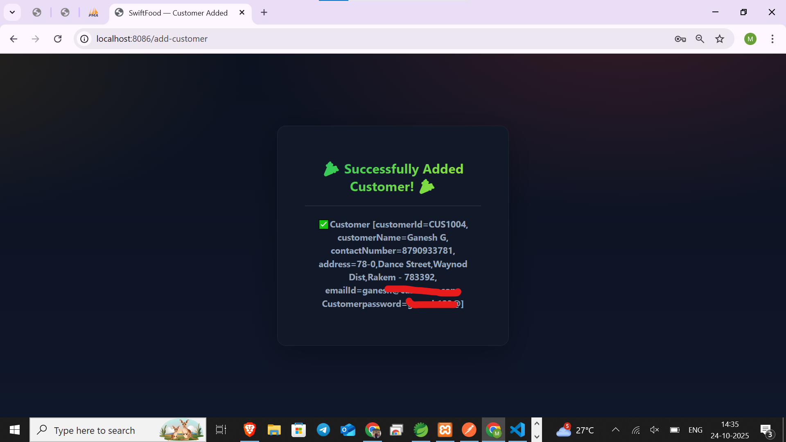

# 🍴 SwiftFood-Journey

This repository tracks my journey of transforming the **SwiftFoodApp** (initially a console-based Java application) into a **full-fledged web application** using **Spring Boot**.  
I’ll be updating this file daily to document progress, ensure direction, and stay consistent.

---

## 🗓️ Day 1 (23 - 10 - 2025)

### ✅ Progress
- Created the **base Spring Boot project** in **Eclipse IDE**.  
- Set up the initial **Model**, **Controller**, and **View** components for the `Customer` entity.  
- Verified that data from the repository is being successfully passed to the JSP view.

### 📂 Files Created
 1. `Customer.java`
- Defined as a JPA `@Entity` with fields:
  - `customerId`
  - `customerName`
- Added getters, setters, constructors, and `toString()`.
- **Removed unnecessary `@Component` annotation** (since `@Entity` already manages it via JPA).

 2. `CustomerController.java`
- Annotated with `@Controller`.
- Injected the `CustomerRepo` to fetch all customer records.
- Created endpoint `/all-customers` mapped to a JSP view.
- Used `Model` to pass data to the JSP page.

 3. `DisplayAllCustomers.jsp`
- Implemented a JSP page using JSTL `<c:forEach>` to display all customers.
- Improved presentation with an HTML table layout for better readability.

### 🧠 Learnings & Fixes
- Realized that entities should **not** be autowired as beans.
- Practiced using `Model` to transfer data from the controller to the JSP.
- Gained a better understanding of how Spring Boot integrates with JSP and JSTL.

---
## 🗓️ Day 2 (24 - 10 - 2025)

### ✅ Progress
 - Added additional variables to customer (Phone number,email Id, Passoword and address) in Customer Model.
 - Created `/add-customer` endpoint mapped to JSP View, Adds a single Customer to db.
 - Modified the database schema to align with the newly added fields, ensuring data persistence consistency.
 - Verified end-to-end data flow — user input → controller → repository → database → confirmation JSP.

 - 

 - 

 - 
   
### 🧩 Technical Highlights
  - Validated input fields and ensured successful entity persistence in the database.
  - Introduced basic front-end enhancements using JSP with embedded CSS.
  - Verified the proper rendering of the success page with dynamic customer details.
    
### ⚙️ Hurdles & Fixes

  - Initially got distracted by UI design, which slowed backend logic development.
  - Recognized the importance of maintaining focus on functionality first, followed by visual enhancements.

 ### 🛠️ Fix Implemented
  -  Re-prioritized tasks to focus on backend logic and data flow stability before revisiting UI design.
    

## 🗓️ Day 3 (26 - 10 - 2025)

### ✅ Progress

 - Introduced the Restaurant module to expand SwiftFood’s backend structure.
 - Implemented RESTful APIs for managing restaurants using Spring Boot.
 - Added three primary endpoints:

    - /all-restaurants → Fetch all restaurants.
    - /add-restaurant → Add a new restaurant to the database.
    - /find-by-id?restaurantId=RES1001 → Fetch a restaurant by ID using query parameters.

 - Performed API testing using Postman to validate JSON responses and data persistence.
### 📂 Files Created
  1. Restaurant.java
     - A Model class for Restaurant Object.
  2. RestaurantController.java
      - A Controller to handle all the CURD Operation Requests.
      - Implemented 3 primary endpoints (mentioned above).
  3. RestaurantRepo.java
     - Extended JpaRepository<Restaurant, String> for CRUD operations.
### 🧩 Technical Highlights
 - Better exposure to the springboot annotations.
 - Difference between @RestController(used to pass response Objects(used for testing)) and @Controller(used to redirect to jsp pages)
 - Gained deep insights about @RequestParam and @PathVariable.
 - @PathVariable Used when passing variables directly in the URL path (e.g., /find-by-id/RES1001).
 - @RequestParam Used when sending key-value pairs as query parameters (e.g., /find-by-id?restaurantId=RES1001).
 -  #### key Highlight : only focused on building logic rather than chasing front-end design.
### ⚙️ Hurdles & Fixes
 - Encountered 404 Not Found due to incorrect use of path variables and Apache port conflict.
 - Fixed by changing the endpoint mapping to use @RequestParam and verifying correct port (8086).
 - Successfully tested all endpoints via Postman after adjustments.

## 🗓️ Day 4 (29 - 10 - 2025)

 ### ✅ Progress
  - Created Order and Food classes.
  - Order class represents the Order related properties like orderId, orderedFoods, restaurant from which the order is placed, Customer who placed the order.
   `Order.java`
  - Defined as @Entity with primary key `orderId`
   `Food.java`
  - Defined as @Entity with primary key `foodId`

     
